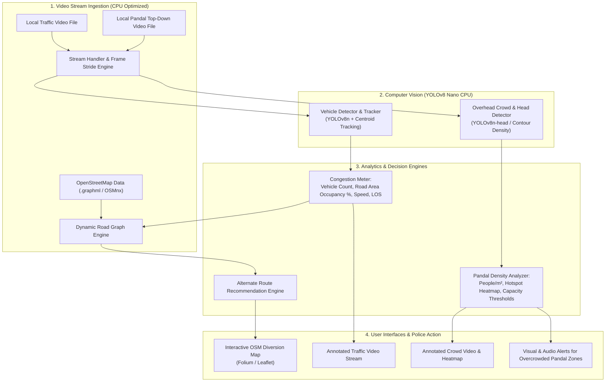

# Technical Implementation Plan: Smart Traffic & Festival Crowd Congestion Management System

## Project Baseline & User Confirmations
- **Compute Environment:** Standard CPU / Laptop (Optimized using `yolov8n` / lightweight ONNX inference with frame-skipping buffers).
- **Video Input:** Local recorded video files (`.mp4`, `.avi`, etc.) downloaded for testing, with seamless extensibility to RTSP feeds.
- **Geographic & Routing Engine:** An included offline road graph via `networkx` for zero-cost police routing and video-driven BPR-style cost updates. The graph can later be replaced by cached OpenStreetMap/GraphML data once a video-to-road-node mapping is defined. Visualized via interactive HTML/Folium maps.
- **Crowd Perspective:** Overhead top-down camera views for festival pandals (Durga Puja), enabling precise head-detection, minimal perspective occlusion, and accurate $people/m^2$ density grids.

---

## Architecture & Data Flow



---

## Component Specifications

### 1. Module A: Traffic Congestion & Police Route Diversion
- **Detection & Tracking (`modules/traffic/`):**
  - Uses `yolov8n.pt` (nano model, runs at 20-30 FPS on modern CPUs).
  - Filters vehicle classes: `car`, `motorcycle`, `bus`, `truck`, `bicycle`.
  - Configurable Road ROI polygon: ignores sidewalk pedestrians or background buildings.
  - **Level of Service (LOS) Logic:**
    - Calculates **Occupancy Ratio** = $(\text{Total Vehicle Area in ROI} / \text{Road ROI Area}) \times 100\%$.
    - Classifies traffic into:
      - **LOS A/B (Free Flow):** Occupancy $< 30\%$
      - **LOS C/D (Moderate):** Occupancy $30\% - 65\%$
      - **LOS E/F (Severe Congestion / Jam):** Occupancy $> 65\%$ or stationary vehicles for $> 15$ seconds.
- **Alternate Route Recommender (`modules/traffic/route_recommender.py`):**
  - Uses the included representative city graph as the offline map source.
  - Maps the configured video bottleneck to a monitored graph segment.
  - Dynamically updates edge traversal weights from measured video occupancy using a BPR-style cost function.
  - Runs penalized Dijkstra / $K$-shortest paths to generate top-2 non-congested alternate routes for traffic police deployment.
  - Generates an interactive Folium map (`outputs/traffic_diversion_map.html`) highlighting the jammed route in red and the suggested diversion in green/blue.

---

### 2. Module B: Durga Puja Pandal Overhead Crowd Monitoring
- **Overhead Crowd & Density Engine (`modules/crowd/`):**
  - Optimized for top-down perspective where human heads/shoulders are visible as circular contours without body occlusion.
  - Features configurable multi-zone polygons:
    - **Zone 1: Entry Queue / Barricade**
    - **Zone 2: Main Sanctum / Idol Viewing Area (Highest risk of stoppage)**
    - **Zone 3: Exit Corridor (Must remain clear)**
  - Computes real-time **Head Count** and **Density ($people/m^2$)** per zone.
  - Generates a dynamic 2D density heatmap overlay (Gaussian kernel smoothing over detections).
  - Evaluates crowd dwell time: tracks if the sanctum viewing crowd is moving or stagnating.
  - **Alert Triggers:**
    - Green: Normal flow.
    - Amber/Yellow: Approaching maximum pandal capacity ($> 2.5 \text{ people}/m^2$).
    - Red / Flashing Alert: Dangerous surge or exit blockage ($> 4.0 \text{ people}/m^2$) $\rightarrow$ Triggers alert for police to hold queue at outer gates.

---

### 3. Utility Tools & Interactive GUI / CLI
- **ROI Calibration Tool (`tools/roi_drawer.py`):**
  - Allows the user to click and define road boundaries or pandal zone polygons on any video frame, saving coordinates to `config/zones.json`.
- **Unified Runner (`run.py`):**
  - Clean CLI and visual OpenCV window with high-contrast HUD for real-time monitoring on standard laptops.
  - Generates analytical summary reports (`outputs/session_report.json` and interactive maps).

---

## Project Directory Layout
```
CongestionDetection/
├── config/
│   ├── config.yaml               # Model settings, frame skip, thresholds
│   └── zones.json                # Calibrated ROIs for roads and pandal zones
├── core/
│   ├── __init__.py
│   ├── stream_loader.py          # CPU-friendly video stream reader with frame stride
│   └── tracker.py                # Centroid and spatial tracker
├── modules/
│   ├── traffic/
│   │   ├── __init__.py
│   │   ├── vehicle_detector.py   # YOLOv8n detector with ROI masking
│   │   ├── congestion_meter.py   # Occupancy % & Level of Service (LOS) calculation
│   │   └── route_recommender.py  # OSMnx / NetworkX dynamic graph diversion
│   └── crowd/
│       ├── __init__.py
│       ├── crowd_detector.py     # Overhead crowd & head detection
│       ├── density_analyzer.py   # Zonal count, people/m², and heatmap generator
│       └── alert_system.py       # Pandal surge and choke-point alerts
├── tools/
│   └── roi_drawer.py             # Interactive GUI tool to draw and save zones
├── data/
│   ├── sample_videos/            # Video input directory
│   └── outputs/                  # Saved annotated videos, logs, and HTML maps
├── requirements.txt
└── run.py                        # Central runner (CLI + visual monitor)
```

---

## Execution Plan & Milestones

1. **Step 1: Environment & Dependency Setup**
   - Create `requirements.txt` with CPU-optimized versions of PyTorch, OpenCV, Ultralytics, OSMnx, NetworkX, Folium, etc.
   - Create the directory hierarchy.
2. **Step 2: Stream Loader & ROI Tool**
   - Implement `core/stream_loader.py` with frame skipping / resize for smooth CPU performance.
   - Implement `tools/roi_drawer.py` so the user can easily define custom polygons on their downloaded test videos.
3. **Step 3: Vehicle Congestion Detection & Alternate Route Engine**
   - Implement `vehicle_detector.py`, `congestion_meter.py` (LOS computation).
   - Implement `route_recommender.py` using OSMnx with synthetic/cached city road networks and Folium map output.
4. **Step 4: Pandal Crowd & Overhead Density Engine**
   - Implement `crowd_detector.py`, `density_analyzer.py` (zonal counting, $people/m^2$, Gaussian heatmap generation).
   - Implement `alert_system.py` for queue holding and exit clearance warnings.
5. **Step 5: Unified Pipeline & Verification**
   - Build `run.py` to seamlessly run `--mode traffic` or `--mode crowd`.
   - Provide synthetic/simulated sample test generators and verify the entire end-to-end pipeline.
